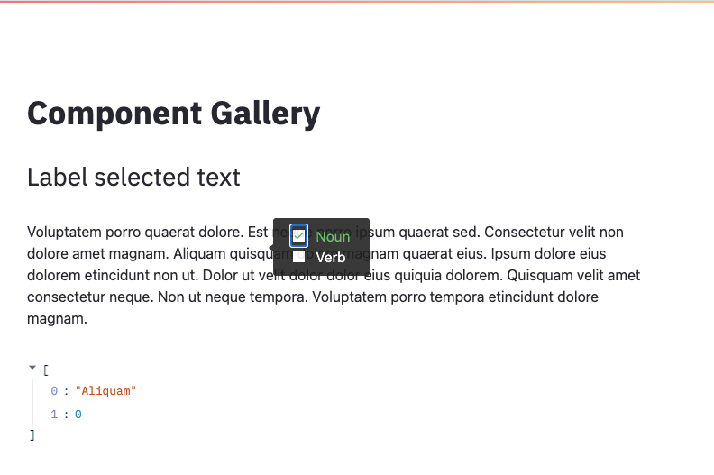

# streamlit-text-label

Custom streamlit component for labelling text selections.


## Usage

Prerequisite:

- python >= 3.6, <= 3.8

```python
from streamlit_text_label import tooltip_select

selected_text, selected_label = tooltip_select(body="lorem ipsum", labels=["Noun", "Verb"])
```

More details in [example](example/app.py) directory.

## Develop

```bash
docker-compose up --build
```

Or manually, start the frontend

```bash
cd streamlit_text_label/frontend
npm install
npm run start
```

Followed by the example app

```bash
pip install -r example/requirements.txt
RELEASE=DEV streamlit run example/app.py
```

## Publish

```bash
cd component/frontend
npm run build
cd ../..
python setup.py sdist bdist_wheel
```
